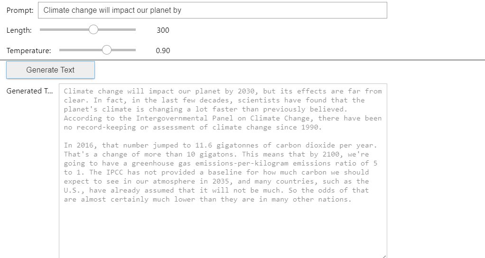

# Text Generation Model

*COMPANY*: CODTECH IT SOLUTIONS

*NAME*: PALADUGU VISHNU VARDHAN

*INTERN ID*: CODF32

*DOMAIN*: ARTIFICIAL INTELLIGENCE 

*DURATION*: 4 WEEEKS

*MENTOR*: NEELA SANTOSH KUMAR

[](https://opensource.org/licenses/MIT)


A Jupyter notebook implementation of text generation using GPT-2 to create coherent paragraphs on user-provided topics.

## 📋 Table of Contents
- [Overview](#overview)
- [Demo](#demo)
- [Installation](#installation)
- [Usage](#usage)
- [Features](#features)
- [Requirements](#requirements)
- [License](#license)

## 🔍 Overview

This project demonstrates how to leverage pre-trained GPT-2 models from Hugging Face to generate coherent text paragraphs on various topics. The implementation includes an interactive Jupyter interface that allows users to enter prompts and control generation parameters.

## 🎮 Demo



## 🚀 Installation

1. Clone this repository:
   ```bash
   git clone https://github.com/Ver-er/Generative-Text-Model.git
   cd Generative-Text-Model
   ```

2. Install the required packages:
   ```bash
   pip install transformers torch ipywidgets jupyter
   ```

## 💻 Usage

1. Start the Jupyter notebook:
   ```bash
   jupyter notebook text_generation_model.ipynb
   ```

2. Run all cells in the notebook

3. In the interactive interface at the bottom of the notebook:
   - Enter your prompt (e.g., "The future of artificial intelligence is")
   - Adjust the generation parameters as desired
   - Click "Generate Text" to create a paragraph on your topic

## ✨ Features

- Uses a pre-trained GPT-2 model from Hugging Face for high-quality text generation
- Interactive interface with adjustable parameters:
  - Text length (50-500 tokens)
  - Temperature (0.1-1.5) to control randomness
- Example prompts provided for quick testing
- Clean, easy-to-follow implementation

## 📦 Requirements

- Python 3.6+
- torch
- transformers
- jupyter
- ipywidgets

## 📄 License

This project is licensed under the MIT License - see the [LICENSE](LICENSE) file for details.

---

 
